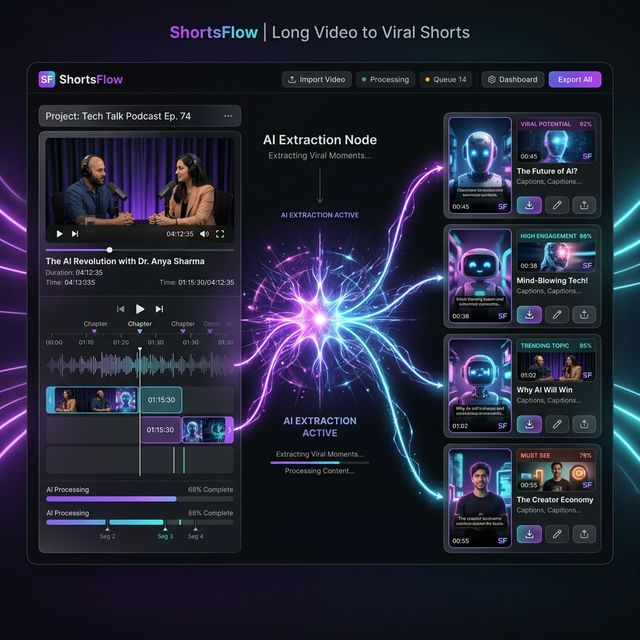

# ⚡ ShortsFlow

> **An AI system that runs an entire YouTube Shorts channel — on autopilot.**

---

## What Is This?

ShortsFlow is an end-to-end content automation system. It doesn't just generate text.

It **writes the script → generates the voice → composes the video → uploads to YouTube, Instagram & Pinterest.**

Zero human involvement. Every 6 hours. Automatically.

---

## What It Produces

### 🎬 Original AI Shorts
Every format is a complete, standalone short — scripted, voiced, and composed entirely by AI.

| Mode | What It Is |
|---|---|
| 🕵️ **Investigator Case Files** | Mystery-framed facts — 2 truths, 1 lie, comment to find out |
| 📖 **Narrated Story** | First-person AI story in a consistent narrator voice |
| 🧩 **Riddle** | Lateral thinking challenge designed to drive comments |
| 🤔 **Would You Rather** | Split-screen dilemma with dual atmospheric backgrounds |
| 📰 **News (Funny / Serious)** | Real RSS headlines rewritten by AI with cartoon personas |
| 💬 **Reddit Story** | Dramatic first-person AITA-style story with moral conflict |
| 🎯 **Find It** | Visual challenge — spot the hidden target among distractors |
| 🔢 **Odd One Out** | Spot the item that doesn't belong |
| 🔊 **Guess The Sound** | Audio challenge with mystery reveal |
| 🧠 **Trivia** | Single question, 3 options, dramatic reveal |
| 💬 **Quote** | Deep cinematic quote over moody footage |
| 🔥 **Trend / Challenge** | Hooks into trending content formats |

### ✂️ Long-Form → Viral Shorts (AI Extraction)
Feed any long-form video and the engine automatically:
1. Transcribes the audio
2. Identifies the highest-impact moments using AI scoring
3. Extracts and packages them as standalone viral clips
4. Generates SEO metadata for each clip

> *Turn a 2-hour podcast or gaming session into 10 optimised shorts or 30 min highlight — in minutes.*

## The Channel

Watch the output live → **[YouTube Channel](https://www.youtube.com/channel/UCO6JXWQh_l4Tk9ld4UIr46Q/)**

The dashboard (multi-user SaaS) → **[Live Dashboard](https://shorts-generator-projects.vercel.app/dashboard)**

---

## Access & Waitlist

This repository is **not publicly cloneable** while the engine is in active development.

If you are a content creator, agency owner, or developer interested in the source code or early access:

👉 **[Join the Waitlist (Google Form)](https://forms.gle/55ScHPeoW4qF17AB6)**

Once you join, you'll be notified of new releases, architecture deep-dives, and when we open the repo for contributors.

---

*Built to solve the automation gap in short-form content creation.*
